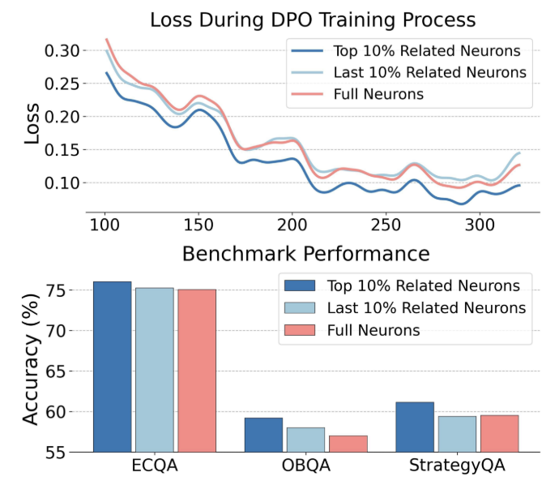
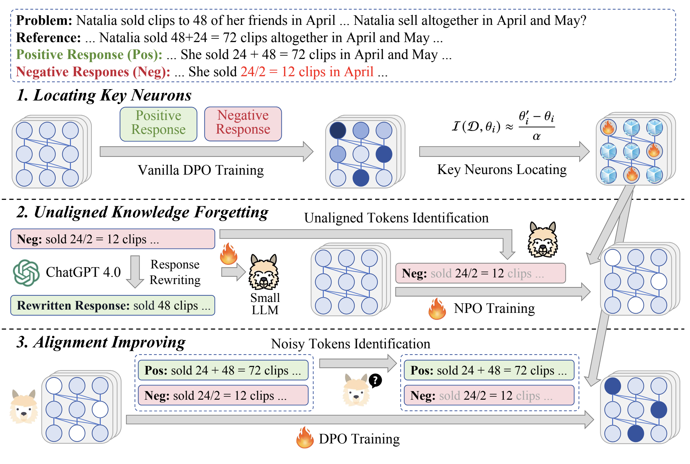
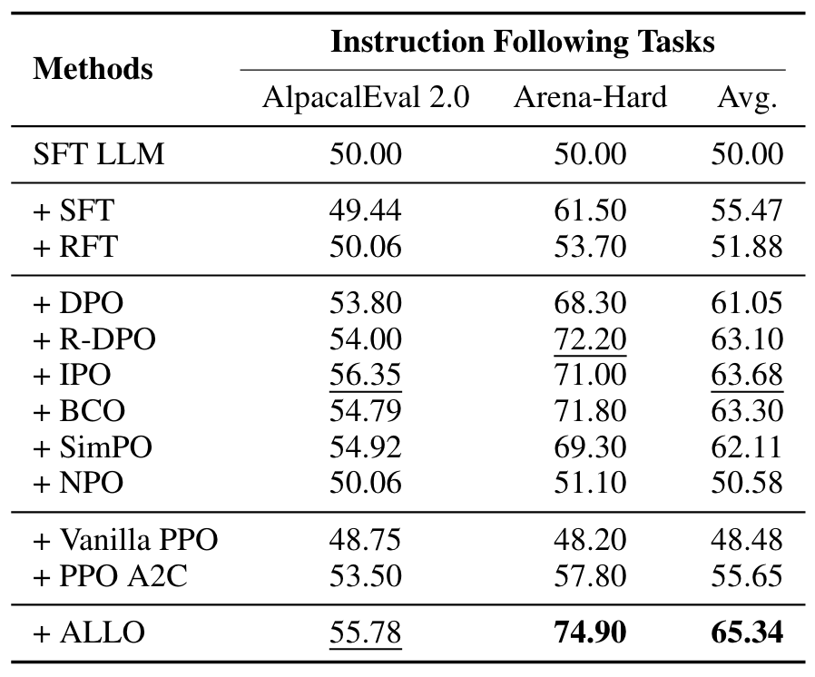
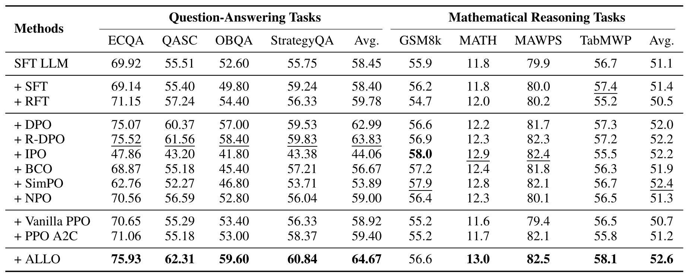

# ALLO
The official repository of ["Low-Redundant Optimization for Large Language Model Alignment''](https://arxiv.org/abs/2406.12606) (arXiv 2024)


## Introduction


Large language models (LLMs) are prone to overfit into the unexpected patterns or superficial styles in the training data. We conduct an empirical study that only selects the top-10% most updated parameters in LLMs for alignment training, and see improvements in the convergence process and final performance. 

<p align="center">  </p>

The empirical study indicates the existence of redundant neurons in LLMs for alignment training. To reduce its influence, we propose a low-redundant alignment method named ALLO, focusing on optimizing the most related neurons with the most useful supervised signals. Concretely, we first identify the neurons that are related to the human preference data by a gradient-based strategy, then identify the alignment-related key tokens by reward models for computing loss. Besides, we also decompose the alignment process into the forgetting and learning stages, where we first forget the tokens with unaligned knowledge and then learn aligned knowledge, by updating different ratios of neurons, respectively. 



Experimental results on 10 datasets have shown the effectiveness of ALLO, **achieving a 9.7% maximum relative improvement over vanilla DPO.**

<p align="center">  </p>
<p align="center">  </p>

## Quick Start

### Environment

In our experiment, we mainly use the following python packages,

```
torch == 2.1.2
transformers == 4.41.1
datasets == 2.16.1
trl == 0.8.2
vllm == 0.2.6
deepspeed == 0.12.4
accelerate == 0.28.0
```


### Data & Code

+ `data/`: Folder contains the training data utilized in our experiment.
    - `qa.jsonl`: The data for question-answering tasks, utilized for SFT and ALLO process.
    - `math.jsonl`: The data for mathematical reasoning tasks, utilized for SFT and ALLO process.
    - `it_sft.jsonl` and `it_allo.jsonl`: The SFT and ALLO data for instruction following tasks, respectively.
+ `preprocess/`: Folder contains the code to pre-process the training data.
    - `gen_neuron_mask/scripts/run_gen.sh`: Selecting the key neurons.
    - `gen_instances/scripts/run_inference.sh`: Sampling the responses from LLMs to construct the following training dataset.
    - `gen_forgetting_data/gen_data.py`: Generating training data for forgetting stage.
    - `gen_forgetting_data/gen_tlr.py`: Generating training data for unaligned tokens identifying.
    - `gen_improving_data/gen_data.py`: Generating training for improving stage.
+ `train/`: Folder contains the code to train the LLMs through ALLO.
    - `scripts/run_warmup.sh`: Start warmup training to identify the key neurons.
    - `scripts/run_forgetting.sh`: Start forgetting to remove the unaligned knowledge in LLM.
    - `scripts/run_improving.sh`: Start improving LLM alignment.


### Run ALLO

To run or reproduce ALLO, you can follow the following steps,

1. Sample the responses from LLM
```
~/ALLO$ bash preprocess/gen_instances/scripts/run_inference.sh
```
2. Train the reference model and identify the key neurons,
```
~/ALLO$ preprocess/gen_improving_data/gen_data.py
~/ALLO$ bash train/scripts/run_warmup.sh
~/ALLO$ bash preprocess/gen_neuron_mask/scripts/run_gen.sh
```
3. Follow [RLMEC](https://github.com/RUCAIBox/RLMEC) to train the small model to generate the token-level reward, which can be utilized to identify the unaligned tokens. To simpily to training process, we only utilize the solution-rewriting task in ALLO.

4. Generate the training data for forgetting stage and perform forgetting training
```
~/ALLO$ python preprocess/gen_forgetting_data/gen_data.py
~/ALLO$ python preprocess/gen_forgetting_data/gen_tlr.py
~/ALLO$ bash train/scripts/run_forgetting.sh
```

5. Generate the training data for improving stage and perform improving training
```
~/ALLO$ preprocess/gen_improving_data/gen_data.py
~/ALLO$ bash train/scripts/run_improving.sh
```

It should be noticed that you need to fill the path to your model and data in the script and code to run ALLO.

### Evaluation

For evaluation, we follow the pipeline proposed by previous work,
+ For question-answering tasks, we follow the [RLMEC](https://github.com/RUCAIBox/RLMEC).
+ For mathematical reasoning tasks, we follow the [JiuZhang3.0](https://github.com/RUCAIBox/RLMEC).
+ For instruction following tasks, we follow the [AlpacaEval](https://github.com/tatsu-lab/alpaca_eval) and [Arean-Hard-Auto](https://github.com/lm-sys/arena-hard-auto).


## Citation

Please cite our paper if you find the repo helpful in your work:

```
@InProceedings{chen2024lowredundant,
      title={Low-Redundant Optimization for Large Language Model Alignment}, 
      author={Zhipeng Chen and Kun Zhou and Wayne Xin Zhao and Jingyuan Wang and Ji-Rong Wen},
      year={2024},
      eprint={2406.12606},
      archivePrefix={arXiv},
      primaryClass = {cs.CL}
}
```